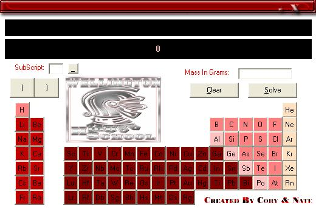



## Mole Scale

### Description

It takes a user inputed weight, in grams, of a chemical compoud and convert's it into moles. I made it for a chemistry project and recieved 200 extra credit points for it.
 
### More Info
 
A little chemistry knowledge would be good.

             |
---                |---
**Submitted On**   |2005-04-06 19:05:44
**By**             |[Cory Shivers](https://github.com/Planet-Source-Code/PSCIndex/blob/master/ByAuthor/cory-shivers.md)
**Level**          |Intermediate
**User Rating**    |4.0 (8 globes from 2 users)
**Compatibility**  |VB 6\.0
**Category**       |[Complete Applications](https://github.com/Planet-Source-Code/PSCIndex/blob/master/ByCategory/complete-applications__1-27.md)
**World**          |[Visual Basic](https://github.com/Planet-Source-Code/PSCIndex/blob/master/ByWorld/visual-basic.md)
**Archive File**   |[Mole\_Scale187309462005\.zip](https://github.com/Planet-Source-Code/cory-shivers-mole-scale__1-59847/archive/master.zip)

